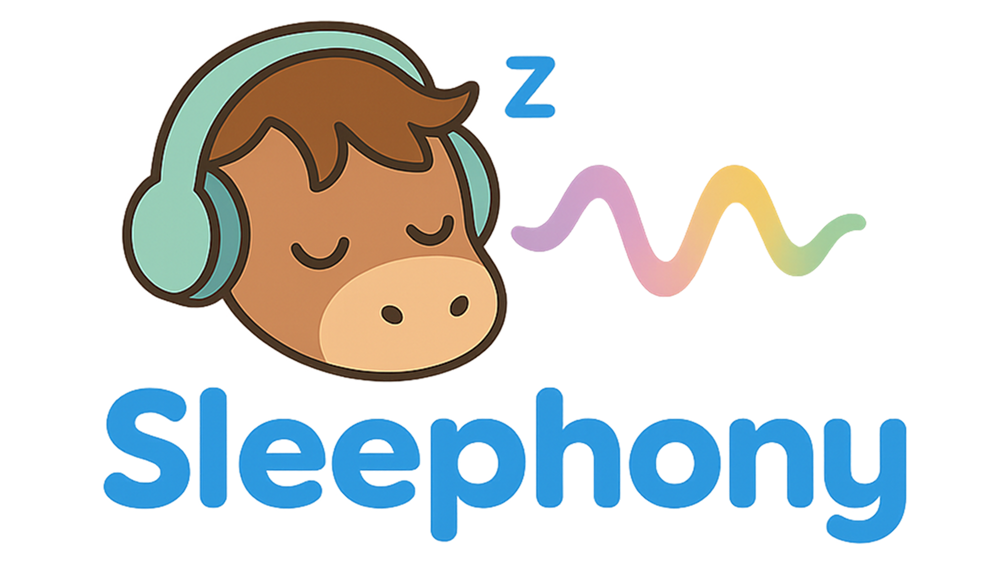
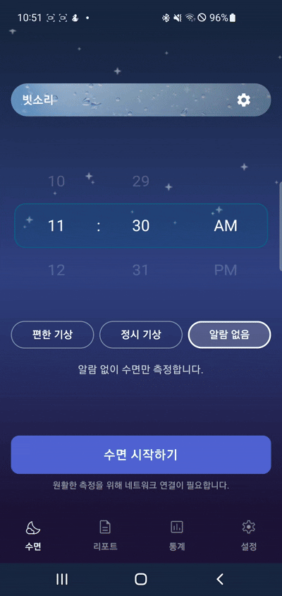
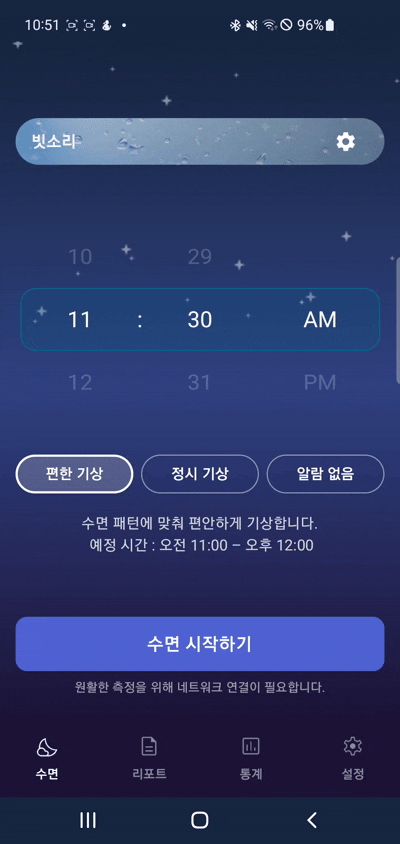
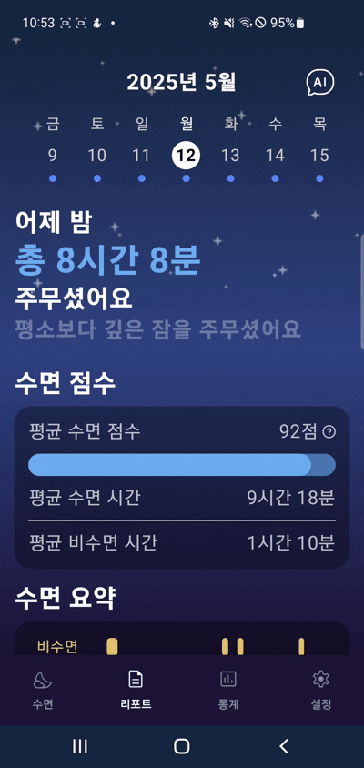
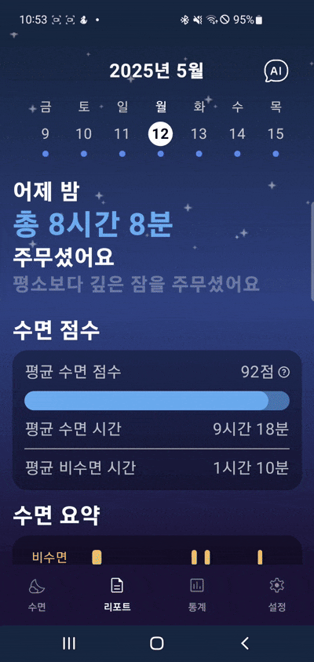
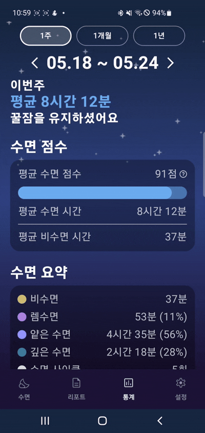
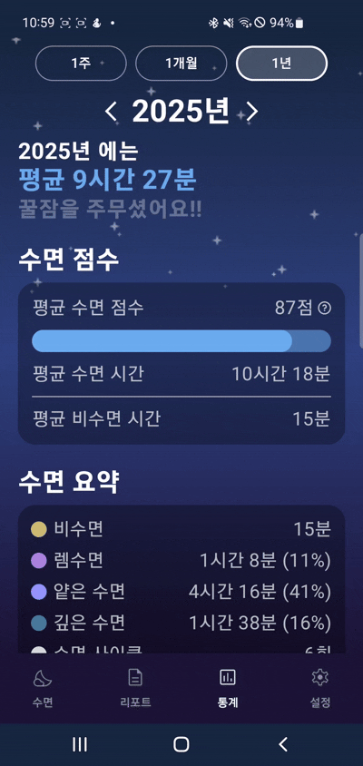
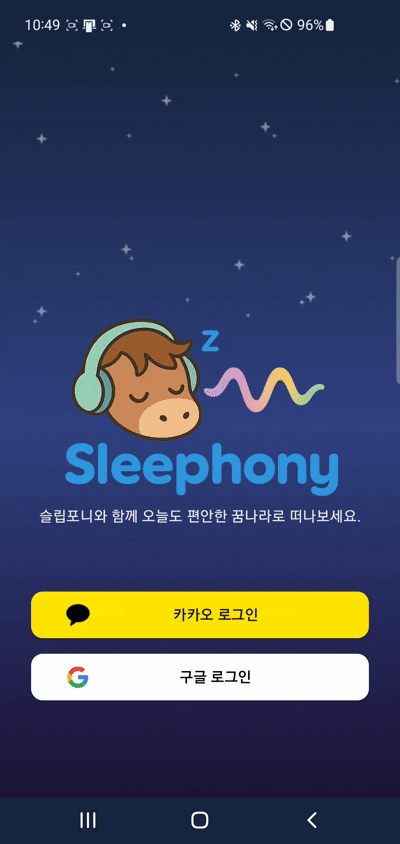

# Sleephony 프로젝트

 
  

## 프로젝트 개요

### 프로젝트 소개

Sleephony는 갤럭시 워치에서 수집한 생체 데이터를 바탕으로, 수면 중 사용자의 수면 단계를 분석하고 그 순간에 가장 적합한 ASMR 또는 소리를 자동으로 재생하여 더 깊고 건강한 수면을 유도하는 스마트 수면 파트너입니다. 
그리고 수면 리포트와 AI 피드백을 제공하여 사용자의 수면 습관 개선을 돕고 있습니다.

### 타겟 사용자

- 수면 건강에 관심 많은 사용자
- 수면 패턴이 불규칙한 직장인 / 수험생
- 수면 장애나 피로감을 자주 느끼는 사용자자
- 웨어러블 기기를 활용한 건강 관리에 익숙한 사용자

### 주요기능

#### 💤수면 측정

- ASMR 테마 설정
- 알람 시간 및 알람 모드 설정
- 실시간 수면 측정 단계에 맞는 ASMR 및 사운드 재생

#### 🗒️수면 리포트

- 날짜별 수면 리포트 제공
- 해당 날짜의 수면 점수 및 수면 요약 정보 제공
- Chat GPT API를 활용한 수면 피드백 제공

#### 📊수면 통계

- 기간별 수면 통계 제공
- 해당 기간의 수면 점수 및 수면 요약 정보 제공
- 기간 수면 시간의 상세 정보 제공
   
   
   

## 개발환경

### 프론트엔드

| 항목                | 기술                                                                                                                                 |
| ------------------- | ------------------------------------------------------------------------------------------------------------------------------------ |
| **개발 환경**       |     |
| **프로그래밍 언어** |                            |
| **빌드 도구**       |                            |
| **UI 툴킷**         |  |
| **인증/보안**       |                               |

### 백엔드

| 항목                | 기술                                                                                                                                                                                                                                                |
| ------------------- | --------------------------------------------------------------------------------------------------------------------------------------------------------------------------------------------------------------------------------------------------- |
| **프로그래밍 언어** |                                                                                                                                              |
| **개발 환경**       |                                                                                                                      |
| **빌드 도구**       |                                                                                                                                           |
| **프레임워크**      |                                                                                                                            |
| **보안**            |   |

### 공통

| 항목             | 기술                                                                                                                                                                                                                                                                                                                             |
| ---------------- | -------------------------------------------------------------------------------------------------------------------------------------------------------------------------------------------------------------------------------------------------------------------------------------------------------------------------------- |
| **형상 관리**    |                                                                                                                       |
| **협업**         |                                                                                                                    |
| **데이터베이스** |                                                                                                                                                                                                                           |
| **커뮤니케이션** |                                                                                                                                                                                                            |
| **배포**         |    |

## 설계

### 시스템 아키텍쳐

  
시스템 아키텍쳐 보기

  

    
  

### 화면 설계서

  
화면 설계서 보기

  

    
  

## 기능 상세

### 수면 측정

#### 테마 설정

#### 알람 설정

#### 수면 측정

### 수면 리포트

#### 날짜별 리포트

#### AI 리포트

### 수면 통계

#### 기간별 수면 통계

### 기타 기능

#### 로그인

#### 개인정보 수정

#### 연동된 스마트워치 확인

#### 사용자 가이드

## 팀원 소개

### 김지원

- 모바일 앱 개발
- 모바일 앱 구조 설정
- 알람 기능, 테마 설정 기능, 수면 측정 기능, 로그인 기능

### 김도현

- 백엔드 서버 개발
- 수면 측정 API, 수면 리포트 및 통계 API

### 김소연

- 인프라, CI/CD

### 김신우

- AI 개발

### 박성원

- 모바일 앱 개발 및 백엔드 서버 개발
- 모바일 앱 수면 리포트 기능
- 백엔드 회원 API

### 전홍석

- 모바일 앱 개발, 웨어러블 앱 개발
- 모바일-웨어러블 연동
- 모바일 수면 통계 기능
